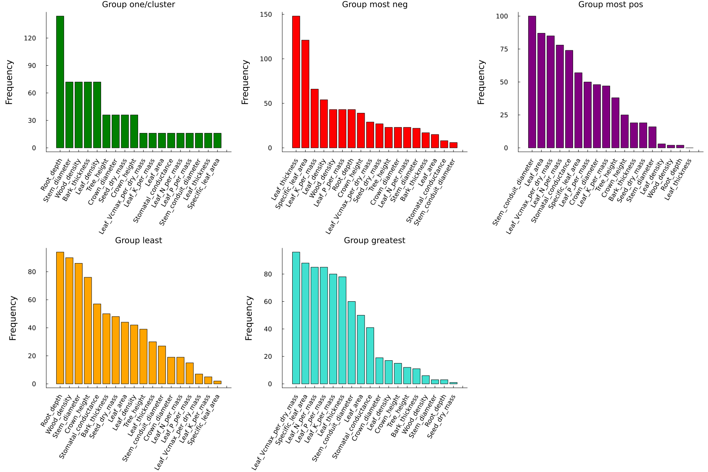
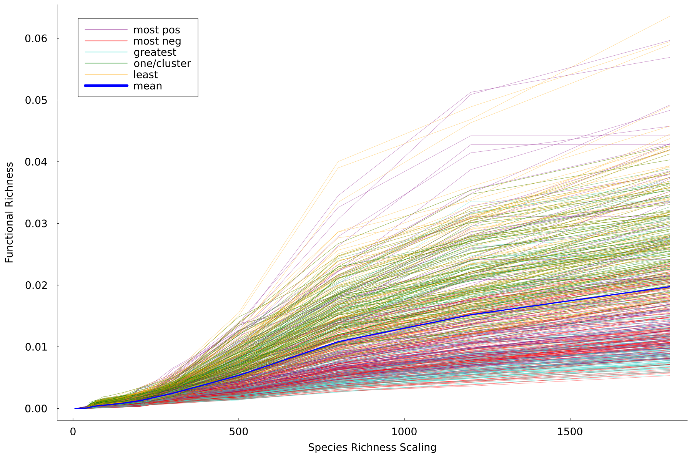
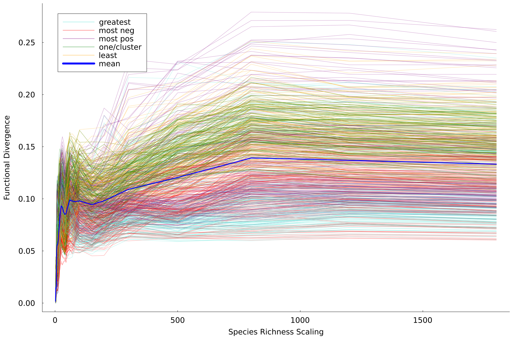
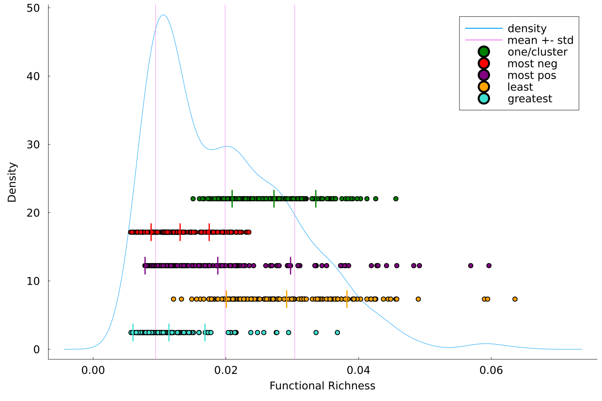
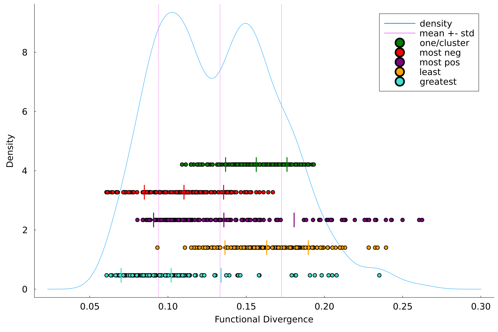
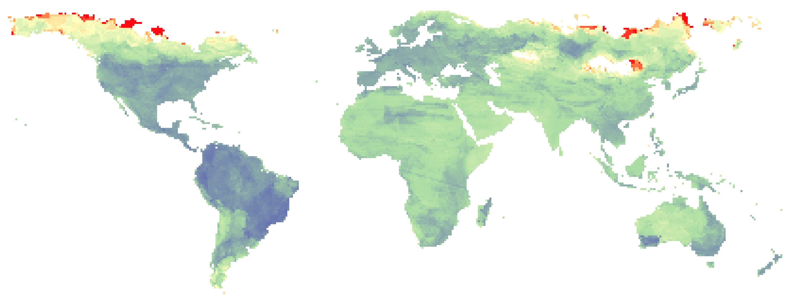
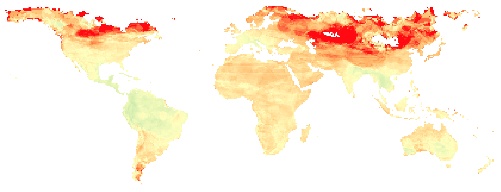
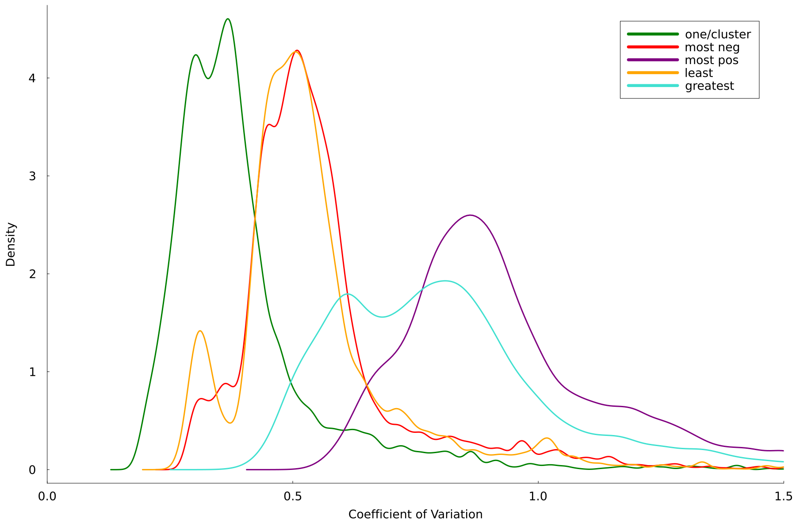
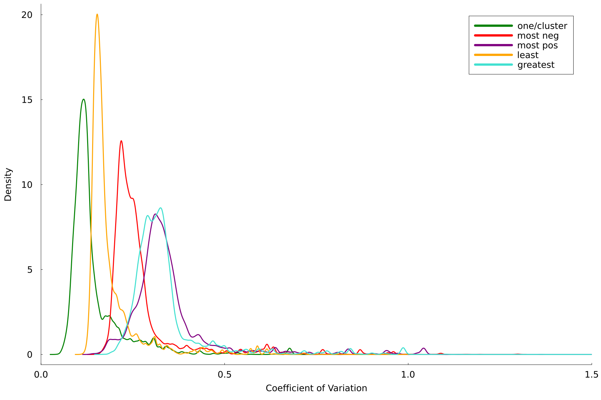

# The impact of plant functional trait choice in inferences of habitat filtering and competition

## Overview ##

This ReadMe should give a brief overview of my thesis and the produced results. For further information please refer to the full paper found in /thesis.

This thesis provides a general understanding of the linkage between tree functional trait selection and variation in functional diversity metrics. Having knowledge about the correlation between traits and their respective clusters, we analysed various trait combination groups which capture different correlation patterns, and compared these to the resulting variation of the diversity metrics. We could show that there is a vast difference between trait groups, not only in their functional diversity metrics but also when it comes to in-group variation.

We focused on following 5 trait combination "groups" where within each group there was a distinct distribution of traits that were considered. For each group we selected ca. 150 trait combinations which best represented our the group in terms of inter trait correlation.

Taking tree funtional trait data from communties around the world we calculated following functional diversity metrics; Q also know as the convex hull of the functional trait space; Rao quadratic entropy which is based on a distance matrix of the functional trait space.

Calculating these two metrics for all 23k+ communities on our world grid was quite the computational challenge especially the calculation of the convex hull in 5 to 8 dimension.

## Results ##

Our results can be summarized as follows:

### Single community ###

Looking at a single grid cell and calculating our diversity metrics using different scales gives an overview of the fast difference there can be between trait combinations. Especially when considering the asymptotic behavior of the diversity value.

Q

Rao

Taking a closer look at the same community as before we can know get a better picture of the distribution of diversity values with a density plot.
We split up each trait combination group to give a better grasp of the within group distribution of diversity values.

Q

Rao

### World Grid ###

We continued with calculating the coefficient of variation between all diversity values of trait combinations within the same trait combiation group. This should show which trait combination group has the least within group variation and therefore provides the most stable results.

Here we show the results of the group with the overall smallest and overall largest coefficient of variation for the Q metric. 

As one can see there is a significant difference in result stability between two possible trait combination groups. This can be summarized by following density plot for coefficient of variation values over all grid cells in the world map.

### Final conclusions ###

Following our analysis of the provided data we can conclude that there is a large difference between diversity metrics depending on the functional traits considered for the analysis. Seing the variation and stability of different kinds of trait combinations we would give the recommendation to focus on trait with little to no correlation.

For more detailed information and analysis of the results please refer to the thesis.

